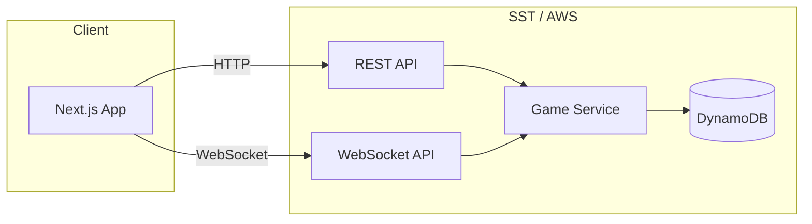

# Plan: Bourbonomics Web Game (SST)

This document outlines a plan to build Bourbonomics as a multiplayer web game using [SST](https://sst.dev) (Serverless Stack) for backend and infrastructure, with the existing Next.js app as the frontend.

---

## Goals

- **Multiplayer** — Support 2+ players in a single game with turn order, trading, and shared market/board state.
- **Real-time** — Players see board updates, market demand, and turn changes without full refresh.
- **Rules-accurate** — Implement the flow in [GAME_RULES.md](./GAME_RULES.md): phases (Rickhouse Fees → Preparation → Operations → Market), mash/rickhouse/bourbon card logic, and win conditions.
- **Deployable** — Use SST to define and deploy API, real-time layer, and persistence so the app runs in AWS (or configured provider) with minimal manual setup.

---

## Architecture Overview

- **Next.js (existing)** — UI: board, market, player hand, rickhouses, actions (barrel, sell, trade, buy resources), phase indicators, and rules reference.
- **SST** — Defines and deploys:
  - **API** — REST endpoints for creating/joining games, fetching game state, and any non–real-time actions if needed.
  - **WebSocket API** — Real-time channel per game room for turn progression, phase changes, market demand updates, trades, and dice rolls.
  - **DynamoDB** (or SST-backed DB) — Persistent game and player state; single source of truth updated by game service.
- **Game service** — Server-side logic (Lambda or similar) that validates moves, applies [GAME_RULES.md](./GAME_RULES.md), updates state, and broadcasts to the WebSocket connection.

---

## SST Stack Shape

- **`sst.config.ts`** (or `.mts`) at repo root: one or more stacks (e.g. `BourbonomicsStack`).
- **Next.js site** — Use SST’s `Nextjs` (or `NextjsSite`) component so the existing app is deployed and wired to the same stack (env for API/WebSocket URLs).
- **API** — `Api` or `ApiGatewayV2` + Lambda handlers for:
  - `POST /games` — Create game (mode: Normal | Bottled-in-Bond, player count).
  - `POST /games/:id/join` — Join as a player (return connection details/token if needed).
  - `GET /games/:id` — Get full game state (for reconnect / load).
- **WebSocket API** — `WebSocketApi` (or API Gateway WebSocket) + Lambda for `$connect`, `$disconnect`, and `$default` (or custom routes like `action`, `trade`, `rollDice`). Connection ID stored per player/game for broadcasting.
- **DynamoDB** — Tables (or single table design):
  - **Games** — `gameId`, mode, status (lobby | in_progress | finished), currentPlayerIndex, phase, marketDemand, round/turn metadata, winner(s), `createdAt`, `updatedAt`.
  - **GameState** — Detailed state per `gameId`: rickhouses (slots and barrelled bourbons per player), market (5 face-up goods, resource deck refs), bourbon card conveyor, each player’s hand (resources, barrelled bourbons, bourbon cards, cash), and any action-card state.
- **Auth** — Optional for MVP: anonymous or simple “nickname + game code” join. Later: SST `Auth` (e.g. Cognito) or third-party for persistent identities.

---

## Data Models (Sketch)

- **Game** — `id`, `mode`, `status`, `playerOrder[]`, `currentPhase`, `currentPlayerIndex`, `marketDemand`, `turnNumber`, `winnerIds[]?`, timestamps.
- **Player** — `id`, `gameId`, `name`, `cash`, `resourceCards[]`, `barrelledBourbons[]` (per barrel: rickhouseId, age, mashRef), `bourbonCards[]` (with Silver/Gold flags), `connectionId?`.
- **Board** — `gameId`, `rickhouses[]` (id, capacity, barrels[]), `marketGoods[]` (5 face-up), `resourceDeck` (draw order or count), `bourbonCardConveyor` (ordering and visibility).
- **MarketPriceGuide** — Stored per bourbon card type (age bands, demand bands, grid); can live in static config or DB.

---

## Frontend (Next.js) Scope

- **Routes** — `/` (lobby: create game / enter code), `/game/[id]` (game room).
- **Game room** — Board view (6 rickhouses, slots, barrels per player), market (5 goods + resource deck + bourbon conveyor), player panel (hand, cash, bourbon cards), phase banner (Phase 1–4), action buttons (Barrel, Sell, Trade, Buy resources, etc.) enabled by phase and turn.
- **Real-time** — WebSocket client that subscribes to `gameId`, receives state deltas or full state, updates React state/context; send actions (e.g. “barrel”, “sell”, “trade”) over WebSocket.
- **Rules** — Link or inline summary from [GAME_RULES.md](./GAME_RULES.md) (e.g. modal or `/rules` page).

---

## Implementation Phases

### Phase 1: SST + Next.js and one API

- Add SST to the repo (`npx sst init` or manual `sst.config.ts`).
- Define one stack that deploys the existing Next.js app (e.g. `Nextjs` component).
- Add one Lambda + route (e.g. `GET /health` or `POST /games`) to confirm API and env wiring.
- Document how to run `sst dev` and open the deployed Next app.

### Phase 2: Game creation and join (REST)

- Implement `POST /games` and `POST /games/:id/join` (and optionally `GET /games/:id`).
- Create DynamoDB table(s) for games and minimal game state; write from Lambdas.
- Frontend: simple lobby UI to create game and join by code; after join, redirect to `/game/[id]` with a placeholder board.

### Phase 3: Game state and turn/phase engine

- Extend game state to match [GAME_RULES.md](./GAME_RULES.md): phases (Rickhouse Fees, Preparation, Operations, Market), turn order, market demand (0–6), rickhouse fees and aging.
- Implement server-side phase progression (e.g. “next phase” or “end turn” endpoint or message) and validation (e.g. pay fees before moving on).
- Frontend: show current phase and turn; minimal UI to “pay fees” and “next phase” for testing.

### Phase 4: Operations (Barrel, Sell, Buy resources, Trade)

- Implement actions: barrel (pay entry rent, place barrel in rickhouse), sell (draw bourbon cards by mash, choose card, apply Market Price Guide, reduce demand), buy resources (1 from market or 2 random; escalating cost), trade (only current player; validate and apply).
- Persist state changes and enforce “current player only” and phase rules.
- Frontend: action buttons and modals/forms for each action; update board and hand from server/real-time.

### Phase 5: Real-time (WebSocket)

- Add WebSocket API in SST; on connect, associate `connectionId` with `gameId` and `playerId`; on disconnect, mark player offline (optional: reconnect token).
- Broadcast game state (or deltas) to all connections in a game when state changes (after API or WebSocket action).
- Optionally move “action” handling to WebSocket messages (e.g. `{ type: "barrel", payload: { rickhouseId, mashRef } }`) so the room updates without polling.
- Frontend: replace or supplement REST polling with WebSocket; show “Player X’s turn” and live updates.

### Phase 6: Market demand and end-of-turn dice

- Implement Phase 4 (Market): after Operations, roll 2 dice; different numbers → +1 demand (cap 6); doubles → subtract that number from demand.
- Persist new demand and advance to next player / next turn (Phase 1 for next player).
- Frontend: show dice roll result and new demand; auto-advance or “Next turn” button.

### Phase 7: Win conditions and polish

- Implement win checks: Triple Crown (3 Gold Awards), Last Baron Standing (others bankrupt), Baron of Kentucky (barrel in all 6 rickhouses). End game and set `winnerIds`.
- UI polish: rickhouse and market visuals, bourbon card images, sound/haptics optional.
- Link [GAME_RULES.md](./GAME_RULES.md) in app and optionally add “Bottled-in-Bond” mode differences in logic and UI.

---

## Tech Choices (SST)

- **SST v3** — Use current major version (e.g. `sst@3`); follow [SST docs](https://sst.dev/docs) for Next.js, API, WebSocket, and DynamoDB.
- **Region / provider** — Default AWS; configure in `sst.config.ts` if needed.
- **State** — DynamoDB for games and game state; single-table or multi-table by preference; consider SST’s `Table` component and access patterns (by `gameId`, by `gameId + playerId`).
- **WebSocket** — API Gateway WebSocket API + Lambda; connection IDs stored per game/player for broadcast.

---

## File / Repo Layout (Suggested)

- `sst.config.ts` — Stack definition (Next.js, Api, WebSocketApi, Table).
- `packages/` or `services/` (optional) — Lambda handlers for API and WebSocket (e.g. `createGame`, `joinGame`, `gameAction`, `wsConnect`, `wsDefault`).
- `app/` — Existing Next.js app (lobby, game room, components).
- `docs/GAME_RULES.md` — Rules reference.
- `docs/WEB_GAME_PLAN.md` — This plan.

---

## Success Criteria

- Players can create a game, join by code, and take turns in a shared game that follows [GAME_RULES.md](./GAME_RULES.md).
- Board, market, and demand update in real time (or with minimal delay) for all players.
- At least one win condition is implemented and the game ends correctly.
- The app and backend are deployable via SST (`sst deploy`) and run in AWS.

---

## References

- [GAME_RULES.md](./GAME_RULES.md) — Authoritative game rules.
- [SST Documentation](https://sst.dev/docs) — Next.js, Api, WebSocket, DynamoDB.
- [SST Next.js](https://sst.dev/docs/component/nextjs) — Deploying Next.js with SST.
